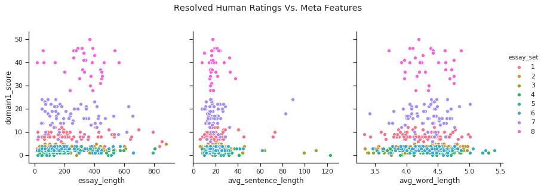
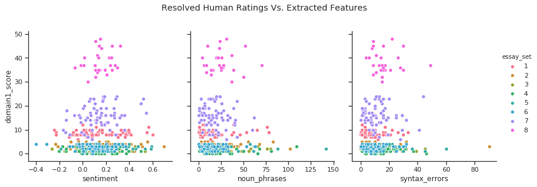
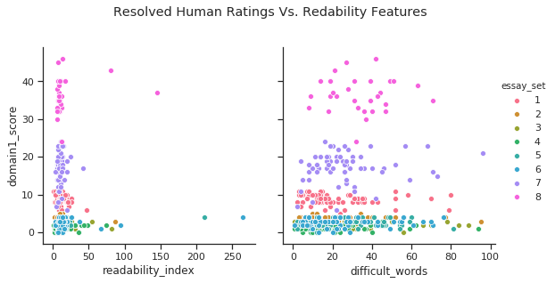

Regression AES — Automated Essay Scoring as regression problem
==============================================================

This project aims to automatically score student essays using NLP techniques.
Here, the problem of automatic grading is approached as a regression problem.

This project uses the ASAP-AES dataset (https://www.kaggle.com/c/asap-aes/data) and builds a model to predict scores for
essays written by Grade 7 to Grade 10 students. To do this, we'll provide the model with a description of many essays 
having various features. The underlying objective is to observe the effect of essay features (taken separately and in 
combination) on the score.

-----
INDEX
-----

1. [About the ASAP-AES Dataset](#1-about-the-asap-aes-dataset)
2. [Some Important Files](#2-some-important-files)
3. [Application Design](#3-application-design)
4. [Results](#4-results)
5. [Setup Instructions](#5-setup-instructions)
6. [Usage Details](#6-usage-details)
7. [Visualization](#7-visualization)
    + [7.1 Scores Across Essay Sets](#71-scores-across-essay-sets)
    + [7.2 Resolved Human Ratings V/s Meta Features.png](#72-resolved-human-ratings-vs-meta-featurespng)
    + [7.3 Resolved Human Ratings V/s Extracted Features.png](#73-resolved-human-ratings-vs-extracted-featurespng)
    + [7.4 Resolved Human Ratings V/s Readability Features.png](#74-resolved-human-ratings-vs-readability-featurespng)


1\. About the ASAP-AES Dataset
------------------------------

The dataset was made available through a competition held by The William and Flora Hewlett Foundation (Hewlett).
There are sevral available data formats including TSV and excel. Each file has a number of columns.
The ones that are important to ur discussion of the project are:
- **essay_set:** 1-8, an id for each set of essays
- **essay:** The ascii text of a student's response
- **rater1_domain1:** Rater 1's domain 1 score; all essays have this
- **rater2_domain1:** Rater 2's domain 1 score; all essays have this
- **domain1_score:** Resolved score between the raters; all essays have this

The `essay_set` indicates which set the essay belongs to. each set has a different writing prompt and different range
of scores in which the human grader grades.

The `essay` column has all the essays in text format with some named entities anonymized as:

    "PERSON", "ORGANIZATION", "LOCATION", "DATE", "TIME", "MONEY", "PERCENT"

Besides, the above score columns, ie. `rater1_domain1`, `rater2_domain1`, `domain1_score` there are scores for other 
domains as well. However, they are not present for each and every essay. These are ignored for simplicity. However, 
incorporating these scores in the model building process post preprocessing may give better results.  

**Table: ASAP-AES Dataset overview:**

| essay_id | essay_set | essay | rater1_domain1                                    | rater2_domain1 | rater3_domain1 | domain1_score | rater1_domain2 | rater2_domain2 | domain2_score | ... | rater2_trait3 | rater2_trait4 | rater2_trait5 | rater2_trait6 | rater3_trait1 | rater3_trait2 | rater3_trait3 | rater3_trait4 | rater3_trait5 | rater3_trait6 |     | 
|----------|-----------|-------|---------------------------------------------------|----------------|----------------|---------------|----------------|----------------|---------------|-----|---------------|---------------|---------------|---------------|---------------|---------------|---------------|---------------|---------------|---------------|-----| 
| 0        | 1         | 1     | Dear local newspaper, I think effects computer... | 4              | 4              | NaN           | 8              | NaN            | NaN           | NaN | ...           | NaN           | NaN           | NaN           | NaN           | NaN           | NaN           | NaN           | NaN           | NaN           | NaN | 
| 1        | 2         | 1     | Dear @CAPS1 @CAPS2, I believe that using compu... | 5              | 4              | NaN           | 9              | NaN            | NaN           | NaN | ...           | NaN           | NaN           | NaN           | NaN           | NaN           | NaN           | NaN           | NaN           | NaN           | NaN | 
| 2        | 3         | 1     | Dear, @CAPS1 @CAPS2 @CAPS3 More and more peopl... | 4              | 3              | NaN           | 7              | NaN            | NaN           | NaN | ...           | NaN           | NaN           | NaN           | NaN           | NaN           | NaN           | NaN           | NaN           | NaN           | NaN | 
| 3        | 4         | 1     | Dear Local Newspaper, @CAPS1 I have found that... | 5              | 5              | NaN           | 10             | NaN            | NaN           | NaN | ...           | NaN           | NaN           | NaN           | NaN           | NaN           | NaN           | NaN           | NaN           | NaN           | NaN | 
| 4        | 5         | 1     | Dear @LOCATION1, I know having computers has a... | 4              | 4              | NaN           | 8              | NaN            | NaN           | NaN | ...           | NaN           | NaN           | NaN           | NaN           | NaN           | NaN           | NaN           | NaN           | NaN           | NaN | 
| ...      | ...       | ...   | ...                                               | ...            | ...            | ...           | ...            | ...            | ...           | ... | ...           | ...           | ...           | ...           | ...           | ...           | ...           | ...           | ...           | ...           | ... | 
| 12971    | 21626     | 8     | In most stories mothers and daughters are eit...  | 17             | 18             | NaN           | 35             | NaN            | NaN           | NaN | ...           | 4.0           | 4.0           | 4.0           | 3.0           | NaN           | NaN           | NaN           | NaN           | NaN           | NaN | 
| 12972    | 21628     | 8     | I never understood the meaning laughter is th...  | 15             | 17             | NaN           | 32             | NaN            | NaN           | NaN | ...           | 4.0           | 4.0           | 4.0           | 3.0           | NaN           | NaN           | NaN           | NaN           | NaN           | NaN | 
| 12973    | 21629     | 8     | When you laugh, is @CAPS5 out of habit, or is ... | 20             | 26             | 40.0          | 40             | NaN            | NaN           | NaN | ...           | 5.0           | 5.0           | 5.0           | 5.0           | 4.0           | 4.0           | 4.0           | 4.0           | 4.0           | 4.0 | 
| 12974    | 21630     | 8     | Trippin' on fen...                                | 20             | 20             | NaN           | 40             | NaN            | NaN           | NaN | ...           | 4.0           | 4.0           | 4.0           | 4.0           | NaN           | NaN           | NaN           | NaN           | NaN           | NaN | 
| 12975    | 21633     | 8     | Many people believe that laughter can improve...  | 20             | 20             | NaN           | 40             | NaN            | NaN           | NaN | ...           | 4.0           | 4.0           | 4.0           | 4.0           | NaN           | NaN           | NaN           | NaN           | NaN           | NaN | 

**Table: Dataset Stats (set-wise):**

|                    | essay_set      | 1         | 2           | 3           | 4           | 5           | 6           | 7           | 8           |
|--------------------|----------------|-----------|-------------|-------------|-------------|-------------|-------------|-------------|-------------|
|   domain1_score    | count          | 1783.0000 | 1800.000000 | 1726.000000 | 1770.000000 | 1805.000000 | 1800.000000 | 1569.000000 | 723.000000  | 
|                    | mean           | 8.528323  | 3.415556    | 1.848204    | 1.432203    | 2.408864    | 2.720000    | 16.062460   | 36.950207   |
|                    | std            | 1.538565  | 0.774512    | 0.815157    | 0.939782    | 0.970821    | 0.970630    | 4.585350    | 5.753502    |
|                    | min            | 2.000000  | 1.000000    | 0.000000    | 0.000000    | 0.000000    | 0.000000    | 2.000000    | 10.000000   |
|                    | 25%            | 8.000000  | 3.000000    | 1.000000    | 1.000000    | 2.000000    | 2.000000    | 13.000000   | 33.000000   |
|                    | 50%            | 8.000000  | 3.000000    | 2.000000    | 1.000000    | 2.000000    | 3.000000    | 16.000000   | 37.000000   |
|                    | 75%            | 10.000000 | 4.000000    | 2.000000    | 2.000000    | 3.000000    | 3.000000    | 19.000000   | 40.000000   |
|                    | max            | 12.000000 | 6.000000    | 3.000000    | 3.000000    | 4.000000    | 4.000000    | 24.000000   | 60.000000   |
|   rater1_domain1   | count          | 1783.0000 | 1800.000000 | 1726.000000 | 1770.000000 | 1805.000000 | 1800.000000 | 1569.000000 | 723.000000  | 
|                    | mean           | 4.260796  | 3.415556    | 1.741020    | 1.320339    | 2.221053    | 2.561111    | 8.023582    | 18.338866   |
|                    | std            | 0.842119  | 0.774512    | 0.777672    | 0.879825    | 0.988515    | 0.979296    | 2.424120    | 3.170147    |
|                    | min            | 1.000000  | 1.000000    | 0.000000    | 0.000000    | 0.000000    | 0.000000    | 0.000000    | 5.000000    |
|                    | 25%            | 4.000000  | 3.000000    | 1.000000    | 1.000000    | 2.000000    | 2.000000    | 6.000000    | 16.000000   |
|                    | 50%            | 4.000000  | 3.000000    | 2.000000    | 1.000000    | 2.000000    | 3.000000    | 8.000000    | 19.000000   |
|                    | 75%            | 5.000000  | 4.000000    | 2.000000    | 2.000000    | 3.000000    | 3.000000    | 10.000000   | 20.000000   |
|                    | max            | 6.000000  | 6.000000    | 3.000000    | 3.000000    | 4.000000    | 4.000000    | 12.000000   | 30.000000   |
|   rater2_domain1   | count          | 1783.0000 | 1800.000000 | 1726.000000 | 1770.000000 | 1805.000000 | 1800.000000 | 1569.000000 | 723.000000  | 
|                    | mean           | 4.267527  | 3.436667    | 1.698725    | 1.316384    | 2.221607    | 2.550000    | 8.038878    | 18.557400   |
|                    | std            | 0.816287  | 0.775808    | 0.752710    | 0.877076    | 0.992030    | 0.977655    | 2.517367    | 3.170669    |
|                    | min            | 1.000000  | 1.000000    | 0.000000    | 0.000000    | 0.000000    | 0.000000    | 0.000000    | 5.000000    |
|                    | 25%            | 4.000000  | 3.000000    | 1.000000    | 1.000000    | 2.000000    | 2.000000    | 6.000000    | 16.000000   |
|                    | 50%            | 4.000000  | 3.000000    | 2.000000    | 1.000000    | 2.000000    | 3.000000    | 8.000000    | 19.000000   |
|                    | 75%            | 5.000000  | 4.000000    | 2.000000    | 2.000000    | 3.000000    | 3.000000    | 10.000000   | 20.000000   |
|                    | max            | 6.000000  | 6.000000    | 3.000000    | 3.000000    | 4.000000    | 4.000000    | 12.000000   | 30.000000   |


2\. Some Important Files
------------------------

This repository contains a couple of Jupyter notebooks, and a single python script.

```
Jupyter Notebooks:
    data_etl.ipynb                  to extract transform and load the ASAP-AES dataset
    regression_model.ipynb          for interactive model building
    
Script:
    main.py                         similar to regression_model.ipynb notebook, see note below

Directories:
    input/asap-aes                  for storing extracted ASAP-AES dataset
    output/training_set_rel3.pkl    a pre formed dataframe with additional features for quick modeling
```

The script file `main.py` makes use of loops for model training and evaluation across all possible feature combinations.
This is different from the `regression_model` notebook, since there training is done on all features at once.


3\. Application Design
----------------------

In a regression problem, we aim to predict the output of a continuous value, like in this case, the score for an essay.
Although the grading is done in discrete steps within the range of 0-60, we can solve this problem through regression.
Other alternative approaches may include classification, Neural Nets and Deap Learning.

First, we load the data into a data frame and compute various sets of features. These can be roughly categorized as:
```python
meta_features = ['essay_length', 'avg_sentence_length', 'avg_word_length']
grammar_features = ['sentiment', 'noun_phrases', 'syntax_errors']
redability_features = ['readability_index', 'difficult_words']
```

1. Meta Features:
    1. Essay Length (number of words)
    2. Average Sentence Length
    3. Average Word Length
2. Grammar Features:
    1. Sentiment (+ve/-ve) *
    2. Noun Phrases Count
    3. Syntax Errors Count
3. Readability Features:
    1. Readability Index Score
    2. Difficult Words Count

These features are computed using [TextBlob][1] package and other method and then fed into a Sequential model with two 
densely connected hidden layers, and an output layer that returns a single, continuous value. This model is trained for 
1000 epochs, and record the training and validation accuracy. Callbacks are provided for early returns in case of no 
further improvement is observed.

**The training happens across all possible feature combinations given and results can be compared (use `main.py` script).
These combinations sum up to 511.**

[1]: https://textblob.readthedocs.io/en/dev/


4\. Results
-----------

Please see the [report here](docs/report/cs421-report.pdf). A summary is provided below:

1. Inclusion of `essay_set` in training feature set always improved the results. Without `essay_set`, QWK 24.
2. The feature set (`sentiment`) performed worst with QWK -0.00016. The only feature set to have a  “chance” agreement.
3. Considering only single feature  sets, (`essay_length`) performed best with QWK ~ 0.15, followed by
   (`avg_sentence_length`), (`difficult_words`), (`noun_phrases`), (`syntax_errors`), (`readability_index`).
4. Adding more features didn't always give better results (i.e. more accurate scores).


5\. Setup Instructions
----------------------

Please make sure that the dataset is downloaded and extracted to input/asap-aes folder.

1. Install and activate python3 virtual environment,
    see: [https://docs.python.org/3/library/venv.html][2]
2. Install required packages via `pip install -r requirements.txt`
3. Download additional library files (see notebooks for details, most likely this won't be an issue)
4. Start Jupyter Server, 
   see: [https://jupyter-notebook-beginner-guide.readthedocs.io/en/latest/execute.html][3]
5. Run `data_etl.ipynb` first, followed by  `regression_model.ipynb`

[2]: https://docs.python.org/3/library/venv.html
[3]: https://jupyter-notebook-beginner-guide.readthedocs.io/en/latest/execute.html

6\. Usage Details
-----------------

As of now, the program has no command line parameters that could be passes.
Just use `python3 main.py` once `output/training_set_rel3.pkl` is created.


7\. Visualization
-----------------

### 7.1 Scores Across Essay Sets


### 7.2 Resolved Human Ratings V/s Meta Features.png


### 7.3 Resolved Human Ratings V/s Extracted Features.png


### 7.4 Resolved Human Ratings V/s Readability Features.png

